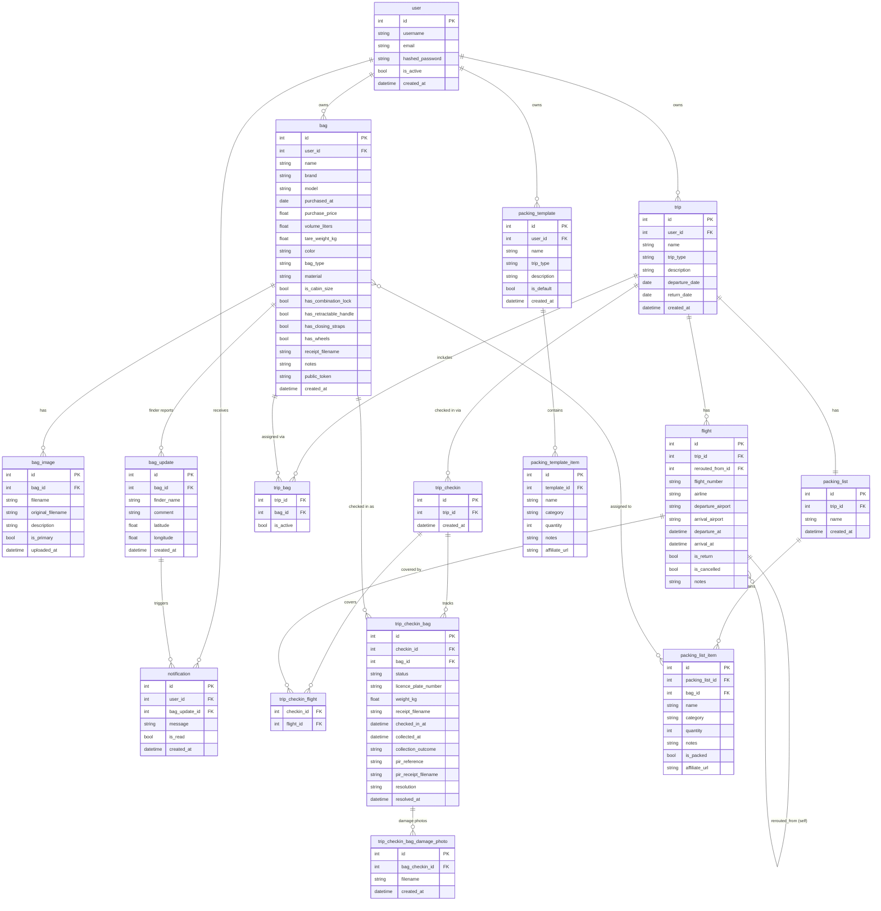

# Data Model

SQLite database managed via SQLAlchemy. No migration framework — schema changes are applied as
`ALTER TABLE` statements in the `lifespan` function in `src/main.py`. New tables are created
automatically by `Base.metadata.create_all` on startup.

---

## Tables

### `user`
Registered accounts.

| Column | Type | Notes |
|---|---|---|
| `id` | INTEGER PK | |
| `username` | VARCHAR(128) | unique, indexed |
| `email` | VARCHAR(254) | unique |
| `hashed_password` | VARCHAR(256) | bcrypt |
| `is_active` | BOOLEAN | default true |
| `created_at` | DATETIME | server default now |

---

### `bag`
A bag owned by a user.

| Column | Type | Notes |
|---|---|---|
| `id` | INTEGER PK | |
| `user_id` | INTEGER FK → `user.id` | cascade delete, indexed |
| `name` | VARCHAR(200) | |
| `brand` | VARCHAR(100) | nullable |
| `model` | VARCHAR(100) | nullable |
| `purchased_at` | DATE | nullable |
| `purchase_price` | FLOAT | nullable |
| `volume_liters` | FLOAT | nullable |
| `tare_weight_kg` | FLOAT | nullable |
| `color` | VARCHAR(2) | IATA color code, e.g. `BK` |
| `bag_type` | VARCHAR(2) | IATA bag type code, e.g. `25` |
| `material` | VARCHAR(1) | IATA material code; null = soft |
| `is_cabin_size` | BOOLEAN | IATA `K` flag |
| `has_combination_lock` | BOOLEAN | IATA `C` flag |
| `has_retractable_handle` | BOOLEAN | IATA `H` flag |
| `has_closing_straps` | BOOLEAN | IATA `S` flag |
| `has_wheels` | BOOLEAN | IATA `W` flag |
| `receipt_filename` | VARCHAR(200) | stored upload path, nullable |
| `receipt_original_filename` | VARCHAR(200) | nullable |
| `notes` | TEXT | nullable |
| `public_token` | VARCHAR(12) | unique, indexed; used for public bag page |
| `created_at` | DATETIME | server default now |

The `iata_code` property assembles the full IATA Baggage Identification Chart code from the above
fields.

---

### `bag_image`
Photos of a bag. Ordered by `uploaded_at` ascending.

| Column | Type | Notes |
|---|---|---|
| `id` | INTEGER PK | |
| `bag_id` | INTEGER FK → `bag.id` | cascade delete, indexed |
| `filename` | VARCHAR(200) | stored upload path |
| `original_filename` | VARCHAR(200) | |
| `description` | VARCHAR(500) | nullable |
| `is_primary` | BOOLEAN | default false; first primary (or first overall) is used as the bag thumbnail |
| `uploaded_at` | DATETIME | server default now |

---

### `bag_update`
A finder report submitted via the public bag page. Ordered newest-first.

| Column | Type | Notes |
|---|---|---|
| `id` | INTEGER PK | |
| `bag_id` | INTEGER FK → `bag.id` | cascade delete, indexed |
| `finder_name` | VARCHAR(200) | |
| `comment` | TEXT | |
| `latitude` | FLOAT | nullable |
| `longitude` | FLOAT | nullable |
| `created_at` | DATETIME | server default now |

---

### `notification`
In-app notification generated when a `bag_update` is created.

| Column | Type | Notes |
|---|---|---|
| `id` | INTEGER PK | |
| `user_id` | INTEGER FK → `user.id` | cascade delete, indexed |
| `bag_update_id` | INTEGER FK → `bag_update.id` | cascade delete |
| `message` | VARCHAR(500) | |
| `is_read` | BOOLEAN | default false |
| `created_at` | DATETIME | server default now |

---

### `trip`
A travel itinerary owned by a user.

| Column | Type | Notes |
|---|---|---|
| `id` | INTEGER PK | |
| `user_id` | INTEGER FK → `user.id` | cascade delete, indexed |
| `name` | VARCHAR(200) | |
| `trip_type` | VARCHAR(50) | nullable; see `TripType` constants |
| `description` | TEXT | nullable |
| `departure_date` | DATE | nullable |
| `return_date` | DATE | nullable |
| `created_at` | DATETIME | server default now |

---

### `flight`
A single flight hop on a trip. Ordered by `departure_at` ascending.

| Column | Type | Notes |
|---|---|---|
| `id` | INTEGER PK | |
| `trip_id` | INTEGER FK → `trip.id` | cascade delete, indexed |
| `flight_number` | VARCHAR(20) | nullable |
| `airline` | VARCHAR(100) | nullable |
| `departure_airport` | VARCHAR(10) | IATA code |
| `arrival_airport` | VARCHAR(10) | IATA code |
| `departure_at` | DATETIME | nullable |
| `arrival_at` | DATETIME | nullable |
| `is_return` | BOOLEAN | false = outward, true = return leg |
| `is_cancelled` | BOOLEAN | default false |
| `rerouted_from_id` | INTEGER FK → `flight.id` | self-referential; set when this flight replaces a cancelled one; ON DELETE SET NULL |
| `notes` | TEXT | nullable |

A flight whose `rerouted_from_id` is set is a rerouting child; root flights have it null.

---

### `trip_bag`
Junction table linking bags to trips. A bag may appear on multiple trips (history), but
`is_active` is true for at most one trip at a time per bag. Assigning a bag to a new trip
sets `is_active = false` on any previous `trip_bag` rows for that bag.

| Column | Type | Notes |
|---|---|---|
| `trip_id` | INTEGER FK → `trip.id` PK | cascade delete |
| `bag_id` | INTEGER FK → `bag.id` PK | cascade delete |
| `is_active` | BOOLEAN | default true; false = historical assignment |

---

### `trip_checkin`
A check-in event for a trip (one per airport check-in session).

| Column | Type | Notes |
|---|---|---|
| `id` | INTEGER PK | |
| `trip_id` | INTEGER FK → `trip.id` | cascade delete, indexed |
| `created_at` | DATETIME | server default now |

Ordered newest-first on the trip. Only one check-in per user should be "active" (has uncollected
checked-in bags) at a time, though this is enforced at the application layer with a warning rather
than a hard constraint.

---

### `trip_checkin_flight`
Many-to-many association between a check-in and the flights it covers.

| Column | Type | Notes |
|---|---|---|
| `checkin_id` | INTEGER FK → `trip_checkin.id` PK | cascade delete |
| `flight_id` | INTEGER FK → `flight.id` PK | cascade delete |

---

### `trip_checkin_bag`
Per-bag status within a check-in event. Unique on `(checkin_id, bag_id)`.

| Column | Type | Notes |
|---|---|---|
| `id` | INTEGER PK | |
| `checkin_id` | INTEGER FK → `trip_checkin.id` | cascade delete, indexed |
| `bag_id` | INTEGER FK → `bag.id` | cascade delete |
| `status` | VARCHAR(20) | `carry_on` or `checked_in` |
| `licence_plate_number` | VARCHAR(10) | baggage tag code from receipt; nullable |
| `weight_kg` | FLOAT | nullable |
| `receipt_filename` | VARCHAR(200) | stored upload path; nullable |
| `checked_in_at` | DATETIME | set when status becomes `checked_in`; nullable |
| `collected_at` | DATETIME | set when bag is collected or outcome recorded; nullable |
| `collection_outcome` | VARCHAR(20) | `collected`, `damaged`, or `missing`; set with `collected_at` |
| `pir_reference` | VARCHAR(50) | Property Irregularity Report number; nullable |
| `pir_receipt_filename` | VARCHAR(200) | stored upload path; nullable |
| `resolution` | VARCHAR(20) | `returned` or `repaired`; set when incident is closed |
| `resolved_at` | DATETIME | nullable |

---

### `trip_checkin_bag_damage_photo`
Photos of damage taken at baggage reclaim. Up to 6 per `trip_checkin_bag`.

| Column | Type | Notes |
|---|---|---|
| `id` | INTEGER PK | |
| `bag_checkin_id` | INTEGER FK → `trip_checkin_bag.id` | cascade delete, indexed |
| `filename` | VARCHAR(200) | stored upload path |
| `created_at` | DATETIME | server default now |

---

### `packing_list`
One packing list per trip (1:1). Created automatically when a trip is created.

| Column | Type | Notes |
|---|---|---|
| `id` | INTEGER PK | |
| `trip_id` | INTEGER FK → `trip.id` | cascade delete, unique, indexed |
| `name` | VARCHAR(200) | default `"Packing List"` |
| `created_at` | DATETIME | server default now |

---

### `packing_list_item`
An item on a trip's packing list. Ordered by `category`, then `name`.

| Column | Type | Notes |
|---|---|---|
| `id` | INTEGER PK | |
| `packing_list_id` | INTEGER FK → `packing_list.id` | cascade delete, indexed |
| `name` | VARCHAR(200) | |
| `category` | VARCHAR(50) | default `other`; see `ItemCategory` constants |
| `quantity` | INTEGER | default 1 |
| `notes` | VARCHAR(500) | nullable |
| `is_packed` | BOOLEAN | default false; only toggleable when `bag_id` is null or bag is active on this trip |
| `bag_id` | INTEGER FK → `bag.id` | ON DELETE SET NULL; optional bag assignment |
| `affiliate_url` | VARCHAR(500) | nullable; preserved from template |

---

### `packing_template`
A reusable packing list template. `user_id` is null for system default templates.

| Column | Type | Notes |
|---|---|---|
| `id` | INTEGER PK | |
| `user_id` | INTEGER FK → `user.id` | nullable (null = system default); cascade delete |
| `name` | VARCHAR(200) | |
| `trip_type` | VARCHAR(50) | nullable |
| `description` | TEXT | nullable |
| `is_default` | BOOLEAN | default false; true for system templates |
| `created_at` | DATETIME | server default now |

---

### `packing_template_item`
An item in a packing template. Ordered by `category`, then `name`.

| Column | Type | Notes |
|---|---|---|
| `id` | INTEGER PK | |
| `template_id` | INTEGER FK → `packing_template.id` | cascade delete, indexed |
| `name` | VARCHAR(200) | |
| `category` | VARCHAR(50) | default `other` |
| `quantity` | INTEGER | default 1 |
| `notes` | VARCHAR(500) | nullable |
| `affiliate_url` | VARCHAR(500) | nullable |

---

## Entity relationship diagram

## Upload storage

All user-uploaded files are stored under `settings.UPLOAD_DIR` with UUID-based filenames.

| Prefix | Used for |
|---|---|
| `checkin_` | Baggage receipt at check-in |
| `damage_` | Damage photos at collection |
| `pir_` | PIR receipt at collection |
| *(none)* | Bag images and purchase receipts |
